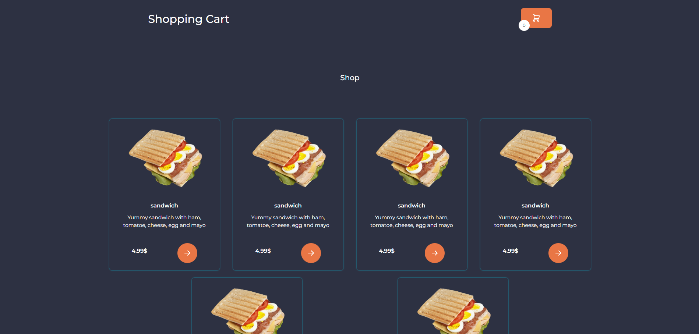
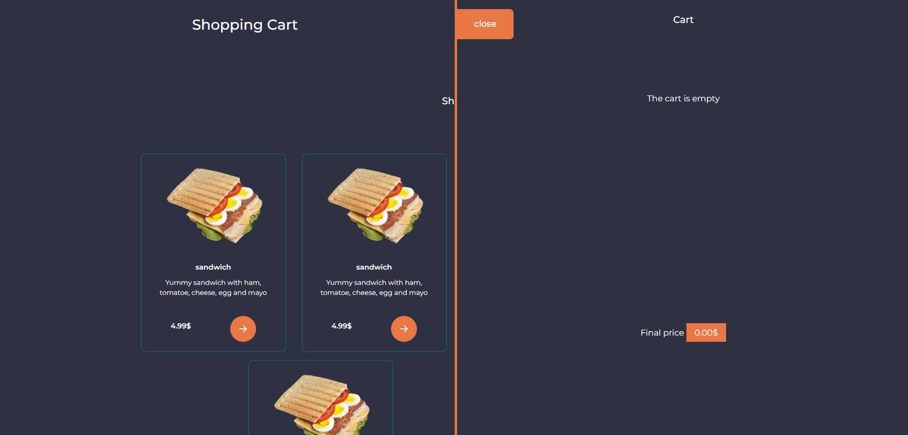

# JavaScript Cart with json data

It's a cart simulator for the browser's side using data from data.json file. You can add and delete produtcs and it will automatically calculate a finall price (You can also edit data.json file to add more products)
Products in cart will be saved in localstorage so if you add some products and reload the site it will be still in your cart  

## Demo

https://szafter12.github.io/JavaScript-Cart-OOP/

## Getting Start
    
    git clone https://github.com/Szafter12/JavaScript-Cart-OOP 

## Appendix

You can edit data.json file to add more products or edit exist products

Remember if you add custom img files you should put them to img folder

In src filed you need to type name of the img file you want to add to the product

## Preview

## Authors

- [@Jakub Pachut](https://www.github.com/Szafter12)

